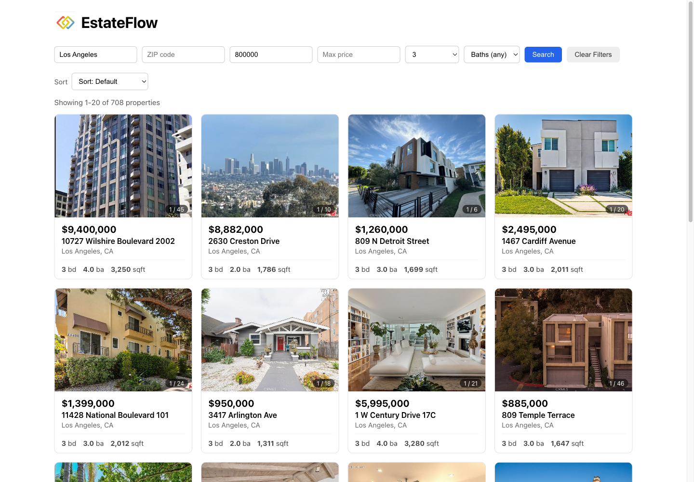
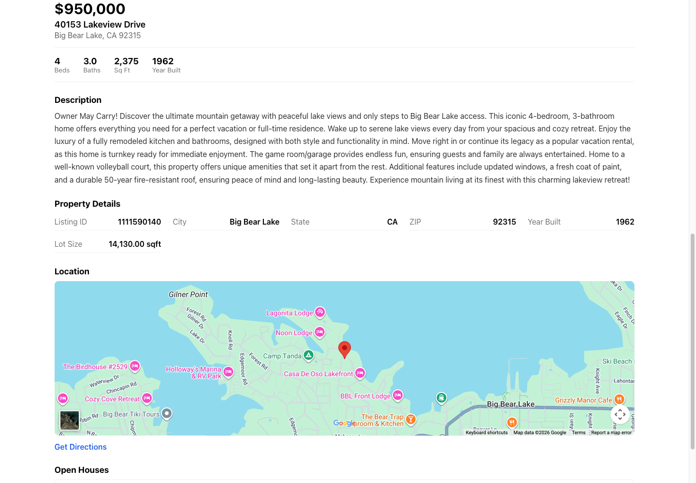

# EstateFlow

A full-stack property search application built on a real IDX/MLS data feed.
It serves 53,122 California listings and 4,282 open-house events out of MySQL
through an Express API, and presents them in a React single-page app with
filtering, sorting, pagination, photo galleries, maps and open-house schedules.


## Screenshots

**Listings page** — filters applied (Los Angeles, min $800,000, 3 beds),
showing 708 matches out of 53,122:



**Property detail page** — stats, description, facts table and location map:



## Features

- **Filtering** by city (case- and whitespace-insensitive), ZIP, price range,
  and exact or minimum bed/bath counts
- **Sorting** by price, date listed, square footage or bedrooms, in either
  direction, with a stable tiebreaker so paging never duplicates a row
- **Pagination** with an ellipsis page bar, capped at 100 rows per request
- **Filters live in the URL**, so a search survives a reload, a shared link,
  and the round trip to a property page and back
- **Photo galleries** — a wrapping carousel on each card, and a full gallery
  with keyboard-navigable lightbox on the detail page
- **Google Maps embed** for listings that have usable coordinates
- **Open-house schedules**, rendered in the calendar day the feed meant rather
  than the one a timezone conversion would shift them to
- **Error boundary** so one bad row cannot blank the whole page

## Tech stack

| Layer | Technology | Version | Why |
|-------|-----------|---------|-----|
| Runtime | Node.js | 22.22.3 | LTS; native `fetch` and stable test tooling |
| | npm | 10.9.8 | ships with Node 22 |
| Backend | Express | 5.2.1 | minimal routing; v5 forwards async errors to middleware automatically |
| | mysql2 | 3.22.5 | promise API and real prepared statements, unlike the older `mysql` driver |
| | cors | 2.8.6 | the frontend dev server is a different origin |
| | dotenv | 17.4.2 | keeps credentials out of the source tree |
| Database | MySQL | 8.0 (Docker) | functional indexes, needed for the `LOWER(TRIM(L_City))` lookup |
| Frontend | React | 19.2.8 | |
| | react-router-dom | 7.18.2 | `useSearchParams` makes the URL the single source of truth for a search |
| | react-scripts (CRA) | 5.0.1 | zero-config build, dev-server proxy, Jest already wired up |
| | prop-types | 15.8.1 | runtime prop validation without adopting TypeScript mid-project |
| Testing | Jest | 30.5.1 (backend) / 27.5.1 (frontend, via CRA) | |
| | Supertest | 7.2.2 | drives the Express app without binding a port |
| | React Testing Library | 16.3.2 | queries by role and label, so tests break on behaviour, not on markup |
| Tooling | nodemon | 3.1.14 | backend auto-restart |
| | ESLint | via `react-app` config | `--max-warnings 0`, so a warning fails the run |

## Getting started

These steps assume a machine with nothing installed yet.

### 1. Prerequisites

- **Node.js 22 or newer** — check with `node -v`. Install from
  [nodejs.org](https://nodejs.org) or via `brew install node`.
- **Docker Desktop** — used to run MySQL 8.0 without installing it on the host.
  Download from [docker.com](https://www.docker.com/products/docker-desktop/).
- **A copy of the `rets` database dump.** The dump is not in this repository:
  it is hundreds of megabytes of licensed listing data, and `.gitignore`
  deliberately excludes `rets_*.sql`.

### 2. Clone the repository

```bash
git clone <your-repo-url> && cd my_code_repo
```

### 3. Start MySQL

```bash
docker run -d --name idx-mysql-local -p 3307:3306 -e MYSQL_ROOT_PASSWORD=change_me -e MYSQL_DATABASE=rets mysql:8.0
```

Port 3307 on the host maps to 3306 in the container, so a MySQL you may already
have running locally does not conflict. Give it about thirty seconds to
initialise, then confirm it is up:

```bash
docker exec idx-mysql-local mysqladmin ping -uroot -pchange_me
```

### 4. Load the data

```bash
docker exec -i idx-mysql-local mysql -uroot -pchange_me rets < /path/to/rets_dump.sql
```

This takes several minutes — the property table is roughly 700 MB.

### 5. Create the indexes

```bash
docker exec -i idx-mysql-local mysql -uroot -pchange_me rets < backend/sql/indexes.sql
docker exec -i idx-mysql-local mysql -uroot -pchange_me rets < backend/sql/indexesw9.sql
```

Both files start with `SET SESSION sql_mode = '';`. That is not decoration:
`CREATE INDEX` revalidates every column in the table, and the feed's
`active_check` column is a `timestamp NOT NULL DEFAULT '0000-00-00 00:00:00'`,
which the default `NO_ZERO_DATE` mode rejects. Without relaxing the mode the
index creation fails on a column the index does not even touch.

### 6. Configure the backend

```bash
cd backend
npm install
cp .env.example .env
```

Open `backend/.env` and set `DB_PASSWORD` to the password used in step 3.
`.env` is gitignored and must never be committed.

### 7. Configure the frontend

```bash
cd ../frontend
npm install
cp .env.example .env
```

The Google Maps key is optional — without it the map area explains what is
missing instead of rendering a broken embed. Everything else works.

### 8. Run both servers

Two terminals:

```bash
cd backend && npm run dev
```

```bash
cd frontend && npm start
```

The API listens on <http://localhost:5001> and the app opens at
<http://localhost:3000>. The frontend calls relative `/api/...` paths, which
the CRA dev server proxies to port 5001 (the `proxy` field in
`frontend/package.json`), so there is no CORS negotiation in development.

> **Why 5001 and not 5000?** On macOS, port 5000 belongs to the AirPlay
> Receiver, which answers requests with a 403. The symptom is a frontend that
> looks broken while the backend appears to have started fine.

### 9. Confirm it works

```bash
curl http://localhost:5001/api/health
```

Expect `{"status":"ok","database":"connected"}`. A `disconnected` response
means the API is running but cannot reach MySQL — check that the container is
up and that `DB_PORT` is 3307.

## Testing

```bash
cd backend && npm test          # 56 tests
cd frontend && CI=true npm test # 176 tests
```

Coverage, with thresholds enforced — both commands exit non-zero if coverage
drops below the bar:

```bash
cd backend && npm run test:coverage
```

```bash
cd frontend && npm run test:coverage
```

| Suite | Tests | Statements | Branches | Functions | Lines |
|-------|-------|-----------|----------|-----------|-------|
| Backend (`app.js`, routes, middleware) | 56 | 99.4% | 94.5% | 100% | **99.4%** |
| Frontend (all of `src/`) | 176 | 94.3% | 91.6% | 95.8% | **96.8%** |
| Frontend components only | — | 100% | 98.8% | 100% | **100%** |

**The backend suite mocks the database pool**, so it needs neither Docker nor
MySQL and finishes in under a second. That is deliberate: a suite that only
runs when a container happens to be up is a suite that stops being run. It also
lets tests set up states the real data cannot produce on demand — an empty
result page, a listing with no open houses, a query that throws.

Linting:

```bash
cd frontend && npm run lint
```

## API reference

Base URL in development: `http://localhost:5001`

All responses are JSON. Errors use the shape `{ "error": "message" }`.

---

### `GET /api/health`

Liveness probe. Runs `SELECT 1` against the pool, so it fails when the database
is unreachable rather than reporting a healthy service.

```bash
curl http://localhost:5001/api/health
```

| Condition | Status | Body |
|-----------|--------|------|
| MySQL reachable | `200` | `{"status":"ok","database":"connected"}` |
| MySQL unreachable | `500` | `{"status":"error","database":"disconnected"}` |

---

### `GET /api/properties`

A paginated, filterable, sortable list of properties.

**Query parameters** — all optional, and each may appear at most once.

| Param | Type | Default | Notes |
|-------|------|---------|-------|
| `limit` | integer 1–100 | 20 | page size |
| `offset` | integer ≥ 0 | 0 | rows to skip |
| `city` | string | — | compared as `LOWER(TRIM(...))` on both sides |
| `zipcode` | string | — | exact match |
| `minPrice` | integer ≥ 0 | — | `L_SystemPrice >= ?` |
| `maxPrice` | integer ≥ 0 | — | `L_SystemPrice <= ?` |
| `beds` | integer ≥ 0 | — | **exact** bedroom count |
| `baths` | number ≥ 0 | — | **exact** bathroom count, decimals allowed |
| `minBeds` | integer ≥ 0 | — | minimum bedrooms; backs the UI's "5+" choice |
| `minBaths` | number ≥ 0 | — | minimum bathrooms |
| `sortBy` | `price` \| `dateListed` \| `sqft` \| `beds` | — | anything else is a 400 |
| `sortOrder` | `asc` \| `desc` | `asc` | rejected without `sortBy` |

`beds` and `minBeds` are separate parameters on purpose. Keeping `beds` an
unambiguous exact match means the dropdown's "3" cannot quietly become
"3 or more", while "5+" still has somewhere to go.

**Example request**

```bash
curl "http://localhost:5001/api/properties?city=Los%20Angeles&minPrice=800000&beds=3&limit=2"
```

**Example response** (`200`)

```json
{
  "total": 708,
  "limit": 2,
  "offset": 0,
  "results": [
    {
      "L_ListingID": "1058444563",
      "L_Address": "10727 Wilshire Boulevard 2002",
      "L_City": "Los Angeles",
      "L_State": "CA",
      "L_Zip": "90024",
      "price": 9400000,
      "beds": 3,
      "baths": "4.0",
      "sqft": 3250,
      "L_Photos": "[\"https://api.cotality.com/trestle/Media/...\", \"...\"]"
    }
  ]
}
```

`total` is the count of everything matching the filters, not the length of
`results` — the frontend needs it to work out how many pages exist. `baths`
arrives as a string because the column is `DECIMAL(4,1)` and mysql2 preserves
decimal precision rather than risking a float. `L_Photos` is a JSON array
**encoded as a string**; nothing between MySQL and the browser parses it.

**Errors**

| Case | Status | Body |
|------|--------|------|
| `?limit=0` | `400` | `{"error":"limit must be >= 1"}` |
| `?limit=101` | `400` | `{"error":"limit must be <= 100"}` |
| `?minPrice=cheap` | `400` | `{"error":"minPrice must be a non-negative integer"}` |
| `?city=a&city=b` | `400` | `{"error":"city must be provided at most once"}` |
| `?sortBy=nope` | `400` | `{"error":"sortBy must be one of: price, dateListed, sqft, beds"}` |
| `?sortOrder=asc` (no `sortBy`) | `400` | `{"error":"sortOrder requires sortBy"}` |
| database failure | `500` | `{"error":"Internal server error"}` |

Every one of these fails before a query is issued.

---

### `GET /api/properties/:id`

The full record for one listing — `SELECT *`, so all 126 columns.

```bash
curl http://localhost:5001/api/properties/1111590140
```

**Response** (`200`) — abridged:

```json
{
  "L_ListingID": "1111590140",
  "L_Address": "40153 Lakeview Drive",
  "L_City": "Big Bear Lake",
  "L_State": "CA",
  "L_Zip": "92315",
  "L_SystemPrice": 950000,
  "L_Keyword2": 4,
  "LM_Dec_3": "3.0",
  "LM_Int2_3": 2375,
  "YearBuilt": 1962,
  "LotSizeSquareFeet": "14130.00",
  "L_Remarks": "Owner May Carry! Discover the ultimate mountain getaway...",
  "LMD_MP_Latitude": "34.247261000000000",
  "LMD_MP_Longitude": "-116.926158000000000",
  "L_Photos": "[\"https://api-trestle.corelogic.com/trestle/Media/...\"]"
}
```

| Case | Status | Body |
|------|--------|------|
| found | `200` | the record |
| no such listing | `404` | `{"error":"No property found with listing id 99999999"}` |
| non-numeric id | `400` | `{"error":"id must be a numeric listing id"}` |
| more than 20 digits | `400` | `{"error":"id must be at most 20 digits"}` |

---

### `GET /api/properties/:id/openhouses`

Scheduled open houses for one listing, ordered by date and then start time.

```bash
curl http://localhost:5001/api/properties/1111590140/openhouses
```

**Response** (`200`)

```json
[
  {
    "id": 4177,
    "L_ListingID": "1111590140",
    "OpenHouseDate": "2026-06-20T05:00:00.000Z",
    "OH_StartTime": "12:00:00",
    "OH_EndTime": "16:00:00",
    "all_data": "{\"OpenHouseType\":\"Public\",\"OpenHouseRemarks\":null,...}"
  }
]
```

| Case | Status | Body |
|------|--------|------|
| listing exists, has events | `200` | array of events |
| listing exists, nothing scheduled | `200` | `[]` |
| no such listing | `404` | `{"error":"No property found with listing id ..."}` |
| non-numeric id | `400` | `{"error":"id must be a numeric listing id"}` |

The empty case is a `200`, not a `404`. Nothing is missing — there is simply
nothing on. Making it an error would force the frontend to treat a quiet
weekend as a failure. The route runs an existence check first precisely so the
two cases stay distinguishable.

> **`OpenHouseDate` is a UTC timestamp, not a date.** The column is a MySQL
> `DATE`, and mysql2 turns it into a JS `Date`, which serialises as
> `2026-06-20T05:00:00.000Z`. Reading that with `new Date(...)` in a browser
> west of UTC lands on the **previous day**. The frontend takes the first ten
> characters and rebuilds the date from explicit parts instead
> (`frontend/src/utils/openHouse.js`).

## Database schema

Database `rets`, MySQL 8.0. Two tables, joined on `L_ListingID` (a `varchar`,
not an integer, and there is no foreign key between them).

### `rets_property` — 53,122 rows, 126 columns, ~700 MB

The feed's column names are opaque, so the ones the application uses:

| Column | Type | Meaning |
|--------|------|---------|
| `L_ListingID` | `varchar(255)` | listing identifier; the API's `:id` |
| `L_Address` | `varchar(100)` | street address |
| `L_City` / `L_State` / `L_Zip` | `varchar` | location |
| `L_SystemPrice` | `int` | list price, exposed as `price` |
| `L_Keyword2` | `int` | bedrooms, exposed as `beds` |
| `LM_Dec_3` | `decimal(4,1)` | bathrooms, exposed as `baths` |
| `LM_Int2_3` | `int` | living area in square feet, exposed as `sqft` |
| `LotSizeSquareFeet` | `decimal(14,2)` | lot size |
| `YearBuilt` | `int` | year built |
| `ListingContractDate` | `date` | date listed; backs `sortBy=dateListed` |
| `L_Remarks` | `mediumtext` | description |
| `L_Photos` | `longtext` | JSON array of photo URLs, stored as a string |
| `LMD_MP_Latitude` | `decimal(18,15)` | latitude |
| `LMD_MP_Longitude` | `decimal(19,15)` | longitude |

Every column above is nullable, and in practice many are null — see
[Known issues](#known-issues). The remaining ~110 columns are feed plumbing:
system keys, permission flags and timestamps.

### `rets_openhouse` — 4,282 rows, 13 columns

| Column | Type | Meaning |
|--------|------|---------|
| `id` | `int` | primary key |
| `L_ListingID` | `varchar(255)` | the listing this event belongs to |
| `OpenHouseDate` | `date` | the day |
| `OH_StartTime` / `OH_EndTime` | `time` | the window |
| `all_data` | `longtext` | the raw feed record, ~47 fields, as a JSON string |

`all_data` is where the type, showing agent, remarks and refreshments live.
Most of its fields are JSON `null` rather than absent — 3,053 of the 4,282 rows
have a null `OpenHouseRemarks` — so reading it needs a type check, not a
truthiness check on the key existing.

### Indexes

`backend/sql/indexes.sql`:

```sql
CREATE INDEX idx_price ON rets_property (L_SystemPrice);
CREATE INDEX idx_beds  ON rets_property (L_Keyword2);
CREATE INDEX idx_baths ON rets_property (LM_Dec_3);
CREATE INDEX idx_zip   ON rets_property (L_Zip);
CREATE INDEX idx_city_price
  ON rets_property ((LOWER(TRIM(L_City))), L_SystemPrice);
```

`backend/sql/indexesw9.sql`:

```sql
CREATE INDEX idx_listing_date ON rets_property (ListingContractDate);
CREATE INDEX idx_oh_date      ON rets_openhouse (OpenHouseDate);
```

`idx_city_price` is a **composite functional index**. Its first part matches the
exact `LOWER(TRIM(L_City))` expression the query uses. Wrapping a column in a
function makes that column's own index unusable *for a lookup* — MySQL can
still scan `idx_L_City` end to end and test each value, which is what it falls
back to, but it cannot seek. The functional index restores the seek. The second
part carries price, so the common "city plus price range" filter is answered by
one index instead of two.

### Measured impact

Measured on the loaded data, MySQL 8.0.46. Index choice comes from `EXPLAIN`,
timings from `EXPLAIN ANALYZE` (each query run twice, second run reported, so
the buffer pool is warm). "Before" was produced with `IGNORE INDEX` rather than
by dropping the indexes, so both sides are measured against the identical table.

| Query | Before | After | Speedup |
|-------|--------|-------|---------|
| `LOWER(TRIM(L_City)) = 'los angeles'` (3,444 matches) | `idx_L_City`, full index scan, ~11.7 ms | `idx_city_price`, 3,444 rows, ~8.1 ms | ~1.4x |
| `L_SystemPrice >= 300000` | full table scan, ~141 ms | `idx_price` range scan, ~10.2 ms | ~14x |
| city + `minPrice` + `beds` | full table scan, ~142 ms | `idx_city_price`, 2,327 rows, ~5.5 ms | ~26x |
| `ORDER BY ListingContractDate DESC LIMIT 20` | full scan + `Using filesort`, ~144 ms | backward index scan on `idx_listing_date`, 20 rows, ~0.09 ms | ~1,700x |

Two of these are worth reading carefully.

**The city filter barely moves**, and that is the honest result. The table
already carried an `idx_L_City` index, and although `LOWER(TRIM(L_City))`
cannot use it for a lookup, MySQL can still scan that index instead of the
table — far narrower than reading 700 MB of rows. The functional index turns a
scan into a seek, which is a real improvement but not a dramatic one. The
composite's actual value shows up in row three, where carrying price as a
second column lets one index answer the whole filter.

**Sorting is where indexing pays off most.** Without an index on the sort
column, MySQL cannot know which twenty rows come first, so it reads every row
and sorts them all to return twenty — that is what `Using filesort` means.
With the index it walks the index backwards and stops after twenty. Watching
`Using filesort` disappear from the `EXPLAIN` output is the signal that it
worked.

The `rows` figures in `EXPLAIN` are the optimiser's estimates from table
statistics (it estimates ~37,548 for a full scan of the 53,122-row table), not
exact counts.

Reproduce any of it:

```bash
docker exec -it idx-mysql-local mysql -uroot -p rets
```

```sql
-- with the index
EXPLAIN ANALYZE SELECT L_ListingID FROM rets_property
  ORDER BY ListingContractDate DESC LIMIT 20;

-- without it, for comparison
EXPLAIN ANALYZE SELECT L_ListingID FROM rets_property IGNORE INDEX (idx_listing_date)
  ORDER BY ListingContractDate DESC LIMIT 20;

SHOW INDEXES FROM rets_property;
```

## Project structure

```
.
├── backend/
│   ├── app.js                  # Express app: middleware, routes, error handler
│   ├── server.js               # binds the port; nothing else
│   ├── db.js                   # the mysql2 connection pool, exported once
│   ├── app.test.js             # health probe, CORS, unknown routes
│   ├── jest.config.js          # node environment, 70% coverage thresholds
│   ├── jest.setup.js           # silences the request logger during tests
│   ├── middleware/
│   │   ├── requestLogger.js    # method, url, status, duration, slow marker
│   │   └── requestLogger.test.js
│   ├── routes/
│   │   ├── properties.js       # the three property endpoints
│   │   └── properties.test.js  # Supertest against a mocked pool
│   └── sql/                    # index DDL
├── frontend/
│   └── src/
│       ├── api/client.js       # every fetch call lives here
│       ├── components/         # 9 presentational components, all with PropTypes
│       ├── hooks/useProperties.js
│       ├── pages/              # ListingsPage, PropertyDetailPage
│       └── utils/              # filters, pagination, photos, openHouse
└── docs/                       # screenshots
```

The split is deliberate: `components/` holds pieces that render props and
report events upward, `pages/` owns state and data fetching, `utils/` is pure
functions with no React in them, and `api/` is the only place `fetch` appears.
Pure functions being pure is what makes most of the test suite fast and
boring — `utils/pagination.js` is tested exhaustively because it can be.

## Development workflow

Git Flow: `main` is releasable, `develop` integrates, and every change arrives
on a `feature/*` branch merged with `--no-ff` so the branch stays visible in
the history.

```bash
git checkout develop
git checkout -b feature/my-change
# ... work, committing as you go ...
git checkout develop
git merge --no-ff feature/my-change
```

Commits follow [Conventional Commits](https://www.conventionalcommits.org):
`feat:`, `fix:`, `refactor:`, `test:`, `docs:`, `chore:`, with a scope where it
helps — `test(backend): ...`. Before merging, `npm run lint` must exit 0 and
both test suites must pass.

`.github/pull_request_template.md` carries the verification checklist.

## Security notes

- **`.env` files are never committed.** `.gitignore` matches `.env` at any
  depth, and `.env.example` documents the keys with placeholder values.
- **Every query is parameterised.** The one place a value is interpolated into
  SQL is the `ORDER BY` clause, because a column name cannot be a `?`
  placeholder. Both the column and the direction come out of fixed lookup
  tables (`SORTABLE_COLUMNS`, `SORT_DIRECTIONS`), so a caller's string never
  reaches the query — an unrecognised `sortBy` is a 400. There is a test that
  holds that line.
- **Errors do not leak internals.** A failed query logs the real error on the
  server and returns a flat `{"error":"Internal server error"}`; connection
  strings, ports and table names are not the client's business.
- **`REACT_APP_*` variables are public.** Create React App substitutes them
  into the browser bundle at build time, where anyone can read them. Only keys
  that are safe to expose — and restricted at the provider — belong there.
  Server-side secrets belong in `backend/.env` and must never be given a
  `REACT_APP_` name.

## Known issues

**Data quality.** These are properties of the feed, not bugs in the code, but
they shape what the app can show. All counts verified against the loaded data:

| Observation | Rows | Effect |
|-------------|------|--------|
| `L_Photos` is an empty string | 381 | `JSON.parse('')` throws; the helpers return `[]` and a placeholder renders |
| no coordinates | 698 | the map section renders nothing at all |
| coordinates at exactly 0,0 | 16 | treated as unknown — it is a point in the Atlantic |
| no address | 123 | card and detail page show "Address unavailable" |
| no bedroom count | 101 | shown as an em dash, never as `0` or `null` |
| no square footage | 84 | same |
| open houses whose listing is not in `rets_property` | 741 IDs | unreachable through the API, which checks the property exists first |
| open-house dates after 2027 | 4 | years like 4202 and 3022 render as-is; there is no sanity filter |

Most open-house dates are also in the past — the feed's events cluster in June
2026 — so the schedules read as history rather than as something to attend.

**Application limits.**

- **No authentication.** Every endpoint is public. Fine for a local project,
  not for a deployment.
- **Deep pagination gets slower.** `LIMIT ? OFFSET ?` makes MySQL walk and
  discard every skipped row, so page 500 costs more than page 1.
- **No caching.** Every request hits the database, including the `COUNT(*)`
  that runs alongside each page.
- **The dev proxy is development-only.** `frontend/package.json`'s `proxy`
  field is a CRA dev-server feature; a production build needs a real reverse
  proxy or an absolute API URL.
- **Photo loading is slow.** Photos are hotlinked from the MLS CDN, and some
  URLs are dead — the carousel falls back to its placeholder when an image
  fails, but a gallery of 38 photos takes a while to fill in.
- **Docker Desktop on macOS occasionally drops the port binding.** The
  container reports as running while `NetworkSettings.Ports` is empty. Neither
  `docker restart` nor restarting Docker Desktop fixes it; recreating the
  container does.

## Future improvements

- **Cursor-based pagination** keyed on the sort column plus `L_ListingID`, to
  make deep pages as cheap as shallow ones
- **Full-text search** over `L_Remarks` — a `ft_remarks` index already exists
  on the table and is currently unused
- **A caching layer** for the `COUNT(*)`, which rarely changes between requests
  for the same filters
- **CI** running both suites and the linter on every push
- **Containerise the app**, so `docker compose up` brings up database, API and
  frontend together
- **Migrate off Create React App** to Vite; react-scripts 5 pins Jest 27 and is
  no longer maintained
- **TypeScript**, which would replace the PropTypes layer with checks that run
  before the code ships rather than in the console at runtime

## License

MIT
